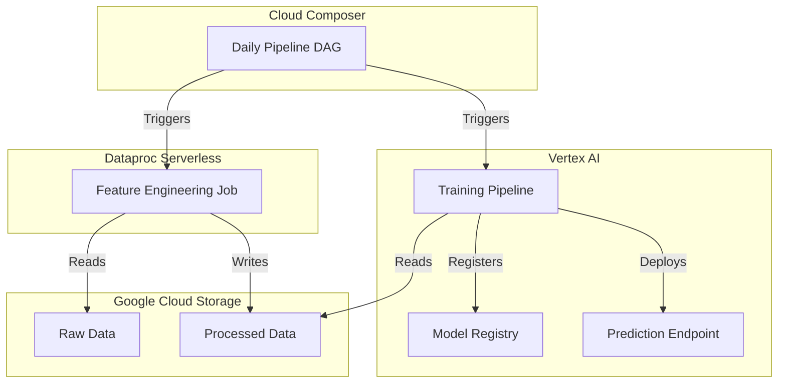

# MLOps Factory Templates 🏭


> **"From Data Chaos to Production AI"** - As seen at DevFest London 2025

Welcome to the **MLOps Factory**. This repository is a production-ready, opinionated template for building scalable MLOps pipelines on Google Cloud Platform. It implements the "Factory" pattern where:

* **Cloud Composer (Airflow)** is the **Factory Manager**, orchestrating the entire workflow.
* **Dataproc Serverless** is the **Heavy Machinery**, processing massive datasets efficiently.
* **Vertex AI** is the **Assembly Line**, training, evaluating, and deploying models.

## 🚀 Features

* **Infrastructure as Code (Terraform)**: One-click deployment of the entire factory.
* **Serverless Data Processing**: PySpark jobs on Dataproc Serverless (no cluster management!).
* **Vertex AI Pipelines**: Reusable KFP v2 components for training and deployment.
* **Feature Store**: BigQuery-backed feature management.
* **Closed-Loop Monitoring**: Automatic retraining triggered by model drift alerts.
* **CI/CD**: Cloud Build integration for automated testing and deployment.

## 🏗️ Architecture



## 🛠️ Getting Started

### Prerequisites

* Google Cloud Project with Billing enabled.
* `gcloud` CLI installed and authenticated.
* `terraform` installed (>= 1.5).

### Deployment in 10 Minutes

1. **Clone the repository:**

    ```bash
    git clone https://github.com/sonikajanagill/mlops-factory-templates.git
    cd mlops-factory-templates
    ```

2. **Initialize Infrastructure:**

    ```bash
    cd terraform
    terraform init
    terraform apply -var="project_id=YOUR_PROJECT_ID"
    ```

    *Type `yes` when prompted.*

3. **Upload Assets:**
    The `cloudbuild.yaml` handles this automatically on push, or you can manually sync:

    ```bash
    # Get bucket name from terraform output
    export DAG_BUCKET=$(terraform output -raw composer_bucket)
    gsutil -m rsync -r ../dags/ gs://$DAG_BUCKET/dags/
    ```

4. **Run the Factory:**
    Go to the Airflow UI (link in Composer console) and trigger `mlops_factory_daily_pipeline`.

## 📂 Repository Structure

* `terraform/`: Infrastructure definitions (IAM, Storage, Composer, Vertex).
* `dags/`: Airflow DAGs for orchestration.
* `src/dataproc/`: PySpark jobs for data processing.
* `pipelines/`: Vertex AI Pipeline definitions and components.
* `functions/`: Cloud Functions for event-driven triggers.

## 💰 Cost Estimate

* **Cloud Composer 3**: ~$0.50/hour (small environment).
* **Dataproc Serverless**: Pay per second of execution.
* **Vertex AI**: Pay per training hour and node hour.
* **Estimated Total for Demo**: < $5.00 (if destroyed after use).

## 🤝 Contributing

Pull requests are welcome! Please read our [Contributing Guide](CONTRIBUTING.md).
