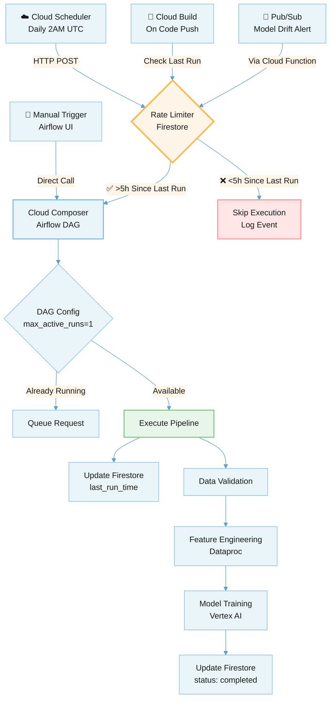

# Multi-Trigger Architecture Guide

**Preventing Redundant Pipeline Executions Across Multiple Trigger Sources**

---

## Overview

The MLOps Factory supports multiple trigger mechanisms for pipeline execution:
- **Cloud Scheduler** - Daily scheduled runs (2 AM UTC)
- **Cloud Build** - Triggered on code changes (CI/CD)
- **Pub/Sub** - Event-driven triggers (model drift alerts)
- **Manual** - Ad-hoc execution via Airflow UI

This guide explains how to prevent redundant executions, manage rate limiting, and prioritize triggers when multiple sources fire simultaneously.

---

## Architecture Diagram



---

## Problem Statement

### Without Rate Limiting

```
09:00 - Developer pushes code → Cloud Build triggers pipeline
09:15 - Pub/Sub drift alert → Cloud Function triggers pipeline  
09:30 - Scheduled cron job → Cloud Scheduler triggers pipeline
10:00 - Another code push → Cloud Build triggers pipeline again

Result: 4 expensive training runs in 1 hour! 💸💸💸
```

### With Rate Limiting (5-hour minimum)

```
09:00 - Developer pushes code → ✅ Pipeline runs (first trigger)
09:15 - Pub/Sub drift alert → ⏸️ Skipped (only 15 min since last)
09:30 - Scheduled cron job → ⏸️ Skipped (only 30 min since last)
10:00 - Code push → ⏸️ Skipped (only 1h since last)
14:01 - Manual trigger → ✅ Pipeline runs (>5h elapsed)

Result: 2 runs in 5 hours (optimal) ✅
```

---

## Implementation Options

### Option 1: Simple - Airflow DAG Configuration (Recommended for Single Source)

**When to use:** Only using Cloud Scheduler OR Cloud Build, not both.

**Pros:**
- ✅ No external dependencies
- ✅ Simple configuration
- ✅ Built into Airflow

**Cons:**
- ❌ Only prevents concurrent runs, not rate limiting
- ❌ Doesn't work across multiple trigger sources

**Implementation:**

```python
# dags/mlops_factory_daily_pipeline.py

with DAG(
    "mlops_factory_daily_pipeline",
    default_args=default_args,
    schedule_interval="@daily",  # 00:00 UTC
    start_date=datetime(2023, 1, 1),
    catchup=False,
    
    # Prevent concurrent executions
    max_active_runs=1,
    max_active_tasks=10,
    dagrun_timeout=timedelta(hours=4),
    
    tags=["mlops", "factory"],
) as dag:
```

---

### Option 2: Intermediate - ShortCircuitOperator (Recommended for Multiple Sources)

**When to use:** Multiple trigger sources (Scheduler + Build + Pub/Sub).

**Pros:**
- ✅ True rate limiting (minimum hours between runs)
- ✅ Uses Airflow Variables (no external service)
- ✅ Easy to configure

**Cons:**
- ⚠️ DAG still starts (consumes a DAG run slot)
- ⚠️ Airflow Variables not ideal for high concurrency

**Implementation:**

**File:** `dags/mlops_factory_daily_pipeline.py`

```python
from airflow.operators.python import ShortCircuitOperator, PythonOperator
from airflow.models import Variable
from airflow.utils.trigger_rule import TriggerRule
from datetime import datetime, timedelta

# Configuration
MIN_HOURS_BETWEEN_RUNS = 5

def check_rate_limit(**context):
    """
    Check if minimum time has elapsed since last successful run.
    Returns True to proceed, False to skip.
    """
    last_run_str = Variable.get("mlops_last_training_run", default_var=None)
    
    if last_run_str is None:
        print("✅ First run - no previous execution found")
        return True
    
    last_run = datetime.fromisoformat(last_run_str)
    time_since_last = datetime.now() - last_run
    hours_since = time_since_last.total_seconds() / 3600
    
    if hours_since < MIN_HOURS_BETWEEN_RUNS:
        print(f"⏸️ RATE LIMIT: Only {hours_since:.1f}h since last run")
        print(f"   Need {MIN_HOURS_BETWEEN_RUNS}h minimum between runs")
        print(f"   Last run: {last_run.strftime('%Y-%m-%d %H:%M:%S')}")
        return False
    
    print(f"✅ PROCEEDING: {hours_since:.1f}h since last run (>{MIN_HOURS_BETWEEN_RUNS}h)")
    return True

def update_last_run_time(**context):
    """Record current run timestamp"""
    now = datetime.now().isoformat()
    Variable.set("mlops_last_training_run", now)
    print(f"📝 Updated last_run_time: {now}")

with DAG(
    "mlops_factory_daily_pipeline",
    default_args=default_args,
    description="Daily MLOps Factory Pipeline with Rate Limiting",
    schedule_interval=None,  # Triggered externally
    start_date=datetime(2023, 1, 1),
    catchup=False,
    max_active_runs=1,
    tags=["mlops", "factory", "rate-limited"],
) as dag:

    # Step 1: Check rate limit (short-circuits if too soon)
    rate_limit_check = ShortCircuitOperator(
        task_id="check_rate_limit",
        python_callable=check_rate_limit,
        provide_context=True
    )

    # Step 2: Validate data
    validate_data = PythonOperator(
        task_id="validate_data",
        python_callable=lambda: print("Data validation passed.")
    )

    # Step 3: Feature engineering
    feature_eng = DataprocCreateBatchOperator(...)

    # Step 4: Trigger training pipeline
    trigger_pipeline = RunPipelineJobOperator(...)

    # Step 5: Update last run timestamp (only on success)
    update_timestamp = PythonOperator(
        task_id="update_last_run_timestamp",
        python_callable=update_last_run_time,
        provide_context=True,
        trigger_rule=TriggerRule.ALL_SUCCESS
    )

    # Task flow
    rate_limit_check >> validate_data >> feature_eng >> trigger_pipeline >> update_timestamp
```

**Setup Commands:**

```bash
# Set rate limit configuration via Airflow Variable
gcloud composer environments run mlops-factory-composer \
  --location us-central1 \
  variables set -- mlops_min_hours_between_runs 5

# View current rate limit status
gcloud composer environments run mlops-factory-composer \
  --location us-central1 \
  variables get -- mlops_last_training_run
```

---

### Option 3: Advanced - Firestore Distributed Lock (Production-Grade)

**When to use:** High-frequency triggers, multi-region deployments, strict consistency.

**Pros:**
- ✅ True distributed locking
- ✅ Works across all trigger sources
- ✅ No DAG run slot consumed for rate-limited requests
- ✅ Scalable and reliable

**Cons:**
- ⚠️ Requires Firestore setup
- ⚠️ Additional GCP service dependency
- ⚠️ Slightly more complex

**Implementation:**

**Step 1: Create Firestore Database**

```bash
# Create Firestore database (Native mode)
gcloud firestore databases create \
  --location=us-central1 \
  --project=YOUR_PROJECT_ID

# Create indexes (optional, for querying)
gcloud firestore indexes composite create \
  --collection-group=mlops_runs \
  --field-config field-path=last_run_time,order=descending
```

**Step 2: Add Firestore Dependency**

```bash
# Update requirements.txt or add to DAGs
echo "google-cloud-firestore>=2.14.0" >> requirements.txt
```

**Step 3: Create Rate Limiter Utility**

**File:** `dags/utils/rate_limiter.py`

```python
from google.cloud import firestore
from datetime import datetime, timedelta
from typing import Tuple, Optional
import logging

logger = logging.getLogger(__name__)

class PipelineRateLimiter:
    """
    Distributed rate limiter using Firestore.
    Prevents pipeline executions within minimum time window.
    """
    
    def __init__(self, project_id: str, min_hours_between_runs: int = 5):
        self.db = firestore.Client(project=project_id)
        self.min_hours = min_hours_between_runs
        self.doc_ref = self.db.collection('mlops_runs').document('training_pipeline')
    
    def can_run(self, trigger_source: str) -> Tuple[bool, str]:
        """
        Check if enough time has passed since last run.
        
        Args:
            trigger_source: Source of trigger (scheduler, cloudbuild, pubsub, manual)
            
        Returns:
            (can_run: bool, reason: str)
        """
        try:
            doc = self.doc_ref.get()
            
            if not doc.exists:
                logger.info("✅ First run - no previous execution found")
                return True, "First run - no previous execution found"
            
            data = doc.to_dict()
            last_run = data.get('last_run_time')
            last_status = data.get('status', 'unknown')
            
            if not last_run:
                return True, "No last run time recorded"
            
            time_since = datetime.now() - last_run
            hours_since = time_since.total_seconds() / 3600
            
            if hours_since < self.min_hours:
                reason = (
                    f"⏸️ Rate limit: Only {hours_since:.1f}h since last run "
                    f"(need {self.min_hours}h). "
                    f"Last run: {last_run.strftime('%Y-%m-%d %H:%M:%S')} "
                    f"by {data.get('triggered_by', 'unknown')}"
                )
                logger.warning(reason)
                return False, reason
            
            reason = (
                f"✅ OK: {hours_since:.1f}h since last run (>{self.min_hours}h). "
                f"Trigger source: {trigger_source}"
            )
            logger.info(reason)
            return True, reason
            
        except Exception as e:
            logger.error(f"Error checking rate limit: {e}")
            # Fail open - allow execution on error
            return True, f"Error checking rate limit (allowing): {e}"
    
    def record_run(self, trigger_source: str, dag_run_id: str):
        """Record pipeline execution start"""
        try:
            self.doc_ref.set({
                'last_run_time': datetime.now(),
                'triggered_by': trigger_source,
                'dag_run_id': dag_run_id,
                'status': 'running'
            })
            logger.info(f"📝 Recorded run start: {dag_run_id} from {trigger_source}")
        except Exception as e:
            logger.error(f"Error recording run: {e}")
    
    def mark_complete(self, success: bool = True):
        """Mark pipeline execution as complete"""
        try:
            self.doc_ref.update({
                'status': 'completed' if success else 'failed',
                'completed_at': datetime.now()
            })
            logger.info(f"✅ Marked run as {'completed' if success else 'failed'}")
        except Exception as e:
            logger.error(f"Error marking complete: {e}")
    
    def get_status(self) -> dict:
        """Get current rate limiter status"""
        try:
            doc = self.doc_ref.get()
            if doc.exists:
                return doc.to_dict()
            return {}
        except Exception as e:
            logger.error(f"Error getting status: {e}")
            return {}
```

**Step 4: Update DAG with Firestore Rate Limiter**

**File:** `dags/mlops_factory_daily_pipeline.py`

```python
import sys
sys.path.insert(0, '/home/airflow/gcs/dags/utils')
from rate_limiter import PipelineRateLimiter

from airflow.operators.python import ShortCircuitOperator, PythonOperator
from airflow.models import Variable

def check_rate_limit_firestore(**context):
    """Check rate limit using Firestore"""
    project_id = Variable.get("project_id")
    trigger_source = context.get('dag_run').conf.get('trigger_source', 'unknown')
    
    limiter = PipelineRateLimiter(
        project_id=project_id,
        min_hours_between_runs=5
    )
    
    can_run, reason = limiter.can_run(trigger_source)
    print(reason)
    
    if can_run:
        limiter.record_run(
            trigger_source=trigger_source,
            dag_run_id=context['dag_run'].run_id
        )
    
    return can_run

def mark_run_complete_firestore(**context):
    """Mark run as complete in Firestore"""
    project_id = Variable.get("project_id")
    limiter = PipelineRateLimiter(project_id=project_id)
    limiter.mark_complete(success=True)

with DAG(...) as dag:
    
    rate_limit_check = ShortCircuitOperator(
        task_id="check_rate_limit_firestore",
        python_callable=check_rate_limit_firestore,
        provide_context=True
    )
    
    # ... other tasks ...
    
    mark_complete = PythonOperator(
        task_id="mark_run_complete",
        python_callable=mark_run_complete_firestore,
        provide_context=True,
        trigger_rule=TriggerRule.ALL_SUCCESS
    )
    
    rate_limit_check >> validate_data >> ... >> mark_complete
```

---

## Pub/Sub Trigger with Deduplication

For event-driven triggers from model monitoring alerts, add deduplication to the Cloud Function.

**File:** `functions/monitoring_trigger/main.py`

```python
import base64
import json
import os
import requests
import google.auth
from google.auth.transport.requests import Request
from google.cloud import firestore
from datetime import datetime, timedelta

db = firestore.Client()

def trigger_dag(event, context):
    """
    Cloud Function triggered by Pub/Sub with rate limiting.
    
    Args:
        event: Pub/Sub event payload
        context: Event metadata (includes event_id for deduplication)
    """
    pubsub_message = base64.b64decode(event['data']).decode('utf-8')
    message_id = context.event_id  # Unique Pub/Sub message ID
    
    print(f"📩 Received Pub/Sub message: {message_id}")
    print(f"   Payload: {pubsub_message}")
    
    # 1. Deduplication - Check if we've already processed this exact message
    doc_ref = db.collection('pubsub_messages').document(message_id)
    doc = doc_ref.get()
    
    if doc.exists:
        print(f"⏸️ Duplicate message {message_id} - already processed")
        return {'status': 'skipped', 'reason': 'duplicate'}
    
    # 2. Rate limiting - Check if minimum time has passed
    last_trigger_ref = db.collection('mlops_runs').document('training_pipeline')
    last_trigger = last_trigger_ref.get()
    
    MIN_HOURS = int(os.environ.get('MIN_HOURS_BETWEEN_RUNS', '5'))
    
    if last_trigger.exists:
        last_data = last_trigger.to_dict()
        last_time = last_data.get('last_run_time')
        
        if last_time:
            time_since = datetime.now() - last_time
            hours_since = time_since.total_seconds() / 3600
            
            if hours_since < MIN_HOURS:
                print(f"⏸️ Rate limit: Only {hours_since:.1f}h since last run (need {MIN_HOURS}h)")
                # Record message as processed to prevent retries
                doc_ref.set({
                    'processed_at': datetime.now(),
                    'skipped': True,
                    'reason': f'rate_limit_{hours_since:.1f}h'
                })
                return {'status': 'skipped', 'reason': 'rate_limit'}
    
    # 3. Trigger Composer DAG
    web_server_url = os.environ.get('COMPOSER_WEB_SERVER_URL')
    client_id = os.environ.get('COMPOSER_CLIENT_ID')
    dag_id = 'monitoring_drift_retrain'
    
    if not web_server_url or not client_id:
        print("❌ Missing COMPOSER_WEB_SERVER_URL or COMPOSER_CLIENT_ID")
        return {'status': 'error', 'reason': 'missing_config'}
    
    credentials, _ = google.auth.default(
        scopes=['https://www.googleapis.com/auth/cloud-platform']
    )
    auth_req = Request()
    credentials.refresh(auth_req)
    
    endpoint = f"{web_server_url}/api/v1/dags/{dag_id}/dagRuns"
    headers = {
        'Authorization': f'Bearer {credentials.id_token}',
        'Content-Type': 'application/json'
    }
    
    data = {
        'conf': {
            'message': pubsub_message,
            'trigger_source': 'pubsub_drift_alert',
            'message_id': message_id,
            'triggered_at': datetime.now().isoformat()
        }
    }
    
    response = requests.post(endpoint, headers=headers, json=data)
    
    if response.status_code == 200:
        print(f"✅ DAG {dag_id} triggered successfully")
        # Record successful trigger
        doc_ref.set({
            'processed_at': datetime.now(),
            'triggered': True,
            'dag_response': response.json()
        })
        return {'status': 'success', 'dag_id': dag_id}
    else:
        print(f"❌ Error triggering DAG: {response.status_code} - {response.text}")
        return {'status': 'error', 'code': response.status_code}
```

**Update Cloud Function Requirements:**

**File:** `functions/monitoring_trigger/requirements.txt`

```
google-cloud-firestore>=2.14.0
google-auth>=2.25.0
requests>=2.31.0
```

---

## Trigger Priority & Override Logic

When multiple triggers arrive, use priority-based execution:

### Priority Levels

1. **CRITICAL** - Model drift detected (Pub/Sub) → Always run
2. **HIGH** - Manual trigger by data scientist → Check rate limit
3. **MEDIUM** - Scheduled daily run (Cloud Scheduler) → Check rate limit
4. **LOW** - Code change (Cloud Build) → Check rate limit + require approval

**Implementation:**

```python
def check_rate_limit_with_priority(**context):
    """Rate limiting with priority override"""
    trigger_source = context.get('dag_run').conf.get('trigger_source', 'unknown')
    priority = context.get('dag_run').conf.get('priority', 'medium')
    
    # CRITICAL triggers always proceed (drift alerts)
    if priority == 'critical':
        print("🚨 CRITICAL trigger - bypassing rate limit")
        return True
    
    # Otherwise check rate limit
    project_id = Variable.get("project_id")
    limiter = PipelineRateLimiter(project_id=project_id, min_hours_between_runs=5)
    
    can_run, reason = limiter.can_run(trigger_source)
    print(reason)
    
    if can_run:
        limiter.record_run(trigger_source, context['dag_run'].run_id)
    
    return can_run
```

---

## Monitoring & Observability

### View Current Rate Limit Status

**Option 1: Query Firestore**

```bash
# View last run info
gcloud firestore documents get \
  projects/YOUR_PROJECT/databases/(default)/documents/mlops_runs/training_pipeline
```

**Option 2: Create Status Dashboard**

**File:** `scripts/check_rate_limit_status.py`

```python
#!/usr/bin/env python3
from google.cloud import firestore
from datetime import datetime
import sys

def check_status(project_id: str):
    """Display current rate limit status"""
    db = firestore.Client(project=project_id)
    doc = db.collection('mlops_runs').document('training_pipeline').get()
    
    if not doc.exists:
        print("❓ No pipeline runs recorded yet")
        return
    
    data = doc.to_dict()
    last_run = data.get('last_run_time')
    
    if last_run:
        time_since = datetime.now() - last_run
        hours_since = time_since.total_seconds() / 3600
        
        print("📊 MLOps Pipeline Rate Limit Status")
        print("=" * 50)
        print(f"Last Run: {last_run.strftime('%Y-%m-%d %H:%M:%S')}")
        print(f"Time Since: {hours_since:.2f} hours")
        print(f"Triggered By: {data.get('triggered_by', 'unknown')}")
        print(f"Status: {data.get('status', 'unknown')}")
        print(f"DAG Run ID: {data.get('dag_run_id', 'unknown')}")
        
        min_hours = 5
        if hours_since >= min_hours:
            print(f"\n✅ Ready to run (>{min_hours}h elapsed)")
        else:
            wait_time = min_hours - hours_since
            print(f"\n⏸️ Must wait {wait_time:.2f} more hours")

if __name__ == '__main__':
    if len(sys.argv) < 2:
        print("Usage: python check_rate_limit_status.py PROJECT_ID")
        sys.exit(1)
    
    check_status(sys.argv[1])
```

**Usage:**

```bash
python scripts/check_rate_limit_status.py your-project-id
```

---

## Configuration Reference

### Environment Variables

| Variable | Purpose | Default | Where to Set |
|----------|---------|---------|--------------|
| `MIN_HOURS_BETWEEN_RUNS` | Minimum hours between executions | 5 | Airflow Variable / Function Env |
| `COMPOSER_WEB_SERVER_URL` | Composer Airflow URL | - | Cloud Function Env |
| `COMPOSER_CLIENT_ID` | OAuth Client ID | - | Cloud Function Env |
| `project_id` | GCP Project ID | - | Airflow Variable |

### Airflow Variables Setup

```bash
# Set required variables
gcloud composer environments run mlops-factory-composer \
  --location us-central1 \
  variables set -- project_id YOUR_PROJECT_ID

gcloud composer environments run mlops-factory-composer \
  --location us-central1 \
  variables set -- region us-central1

gcloud composer environments run mlops-factory-composer \
  --location us-central1 \
  variables set -- bucket_name YOUR_BUCKET_NAME
```

---

## Testing the Rate Limiter

### Test Script

**File:** `tests/test_rate_limiter.sh`

```bash
#!/bin/bash

PROJECT_ID="your-project-id"
COMPOSER_URL="https://your-composer-url"
DAG_ID="mlops_factory_daily_pipeline"

echo "🧪 Testing Multi-Trigger Rate Limiting"
echo "========================================"

# Test 1: First trigger (should succeed)
echo ""
echo "Test 1: First trigger (should succeed)"
gcloud composer environments run mlops-factory-composer \
  --location us-central1 \
  dags trigger -- $DAG_ID \
  --conf '{"trigger_source": "test", "priority": "medium"}'

echo "✅ First trigger sent"
sleep 10

# Test 2: Immediate second trigger (should be rate limited)
echo ""
echo "Test 2: Immediate second trigger (should be rate limited)"
gcloud composer environments run mlops-factory-composer \
  --location us-central1 \
  dags trigger -- $DAG_ID \
  --conf '{"trigger_source": "test", "priority": "medium"}'

echo "⏸️ Second trigger sent (should be skipped)"
sleep 5

# Test 3: Critical priority (should bypass rate limit)
echo ""
echo "Test 3: Critical trigger (should bypass rate limit)"
gcloud composer environments run mlops-factory-composer \
  --location us-central1 \
  dags trigger -- $DAG_ID \
  --conf '{"trigger_source": "test_critical", "priority": "critical"}'

echo "🚨 Critical trigger sent (should proceed)"

echo ""
echo "✅ Test complete. Check Airflow UI for results:"
echo "   - First run: Should execute"
echo "   - Second run: Should short-circuit"
echo "   - Critical run: Should execute"
```

---

## Troubleshooting

### Issue: DAG still runs despite rate limit

**Cause:** `max_active_runs=1` only prevents concurrent runs, not rate limiting.

**Solution:** Ensure ShortCircuitOperator or Firestore rate limiter is implemented.

### Issue: Rate limit not working across trigger sources

**Cause:** Using Airflow Variables without Firestore.

**Solution:** Implement Firestore-based rate limiter (Option 3).

### Issue: Firestore permission denied

**Cause:** Service accounts missing Firestore permissions.

**Solution:**
```bash
# Grant Firestore access to Composer SA
gcloud projects add-iam-policy-binding YOUR_PROJECT \
  --member="serviceAccount:sa-composer@YOUR_PROJECT.iam.gserviceaccount.com" \
  --role="roles/datastore.user"
```

### Issue: Cloud Function not triggering DAG

**Cause:** Missing environment variables or authentication issues.

**Solution:**
```bash
# Verify function configuration
gcloud functions describe monitoring_trigger \
  --region=us-central1 \
  --format="value(environmentVariables)"

# Update if missing
gcloud functions deploy monitoring_trigger \
  --set-env-vars COMPOSER_WEB_SERVER_URL=https://...,MIN_HOURS_BETWEEN_RUNS=5
```

---

## Cost Impact

### Without Rate Limiting
- **Daily scheduled run:** $2/day
- **3 code pushes:** $6/day (3 × $2)
- **2 drift alerts:** $4/day (2 × $2)
- **Monthly cost:** ~$360/month

### With Rate Limiting (5h minimum)
- **1-2 runs per day:** $2-4/day
- **Monthly cost:** ~$60-120/month
- **Savings:** ~70% reduction 💰

---

## Best Practices Summary

1. ✅ Always set `max_active_runs=1` to prevent concurrent executions
2. ✅ Use ShortCircuitOperator for simple rate limiting (single project)
3. ✅ Use Firestore for production-grade distributed locking (multi-trigger)
4. ✅ Implement priority-based overrides for critical triggers
5. ✅ Add deduplication for Pub/Sub messages (use message_id)
6. ✅ Monitor execution patterns via Firestore dashboard
7. ✅ Set reasonable minimum hours (5-6h for daily model training)
8. ✅ Log all rate-limit decisions for debugging

---

## Next Steps

1. Choose implementation option based on your needs:
   - **Simple:** Option 1 (DAG config only)
   - **Recommended:** Option 2 (ShortCircuitOperator)
   - **Production:** Option 3 (Firestore)

2. Update your DAGs with rate limiting logic

3. Configure trigger sources to pass `trigger_source` in conf

4. Test with the provided test script

5. Monitor execution patterns and adjust `MIN_HOURS_BETWEEN_RUNS`

---

**Questions or issues?** Open an issue on GitHub or contact the MLOps team.

**Last Updated:** November 2025
