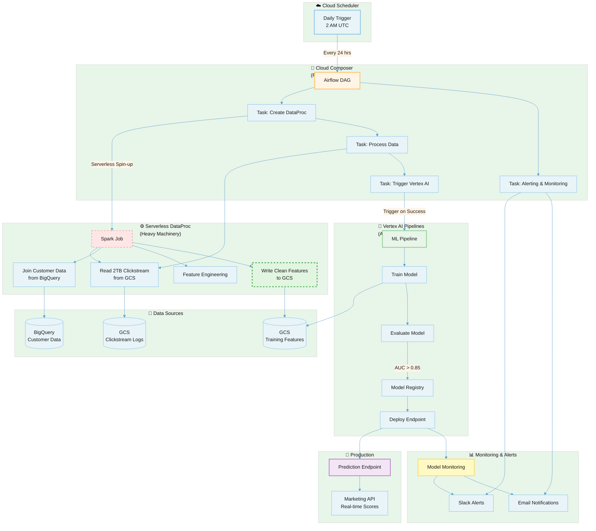

# GitHub Repository Plan

## Architecture diagram:


**Folder structure:**
```
mlops-factory-templates/
├── README.md                    # Clear explanation and architecture diagram
├── architecture/
│   └── mlops-architecture.png   # Your main presentation diagram
├── composer-dags/
│   └── sample_ecommerce_dag.py  # Simple, commented DAG template
├── vertex-ai/
│   └── simple_pipeline.py       # Basic pipeline definition
└── docs/
    ├── getting-started.md       # Step-by-step setup
    └── cost-optimization.md     # Tips and best practices
```

## ** Repository Content **

### **README.md Template:**
```markdown
# MLOps Factory Templates 

> Topic: "From Data Chaos to Production AI"

## Architecture

[Include your main presentation diagram here]

## Quick Start

**Coming Soon:** Full implementation templates (December 2025)

**Available Now:**
- Basic Composer DAG structure
- Simple Vertex AI Pipeline definition  
- Architecture documentation

## What You'll Find Here

- 🏭 **Composer DAGs**: Workflow orchestration templates
- ⚡ **DataProc Jobs**: Big data processing patterns  
- 🤖 **Vertex AI Pipelines**: ML workflow definitions
- 🔧 **Infrastructure**: Terraform modules for setup
- 📊 **Monitoring**: Model drift detection configs

## Get Started

1. Clone this repo
2. Follow [docs/getting-started.md](docs/getting-started.md)
3. Customize for your use case

## Contributing

Found the talk helpful? Contributions welcome!
See open issues for areas needing help.

## Contact

- **Speaker**: Sonika Janagill
- **LinkedIn**: [@sonikaj](https://linkedin.com/in/sonikaj)
- **Medium**: [@sonika.janagill](https://medium.com/@sonika.janagill)
```

### **Basic Composer DAG (30 minutes to create):**
```python
"""
Sample E-commerce Propensity Pipeline DAG - MLOps Factory Talk

This is a TEMPLATE - customize for your use case
"""
from datetime import datetime, timedelta
from airflow import DAG
from airflow.providers.google.cloud.operators.dataproc import (
    DataprocCreateClusterOperator,
    DataprocSubmitJobOperator,
    DataprocDeleteClusterOperator
)

# Default arguments
default_args = {
    'depends_on_past': False,
    'start_date': datetime(2025, 11, 1),
    'email_on_failure': True,
    'email_on_retry': False,
    'retries': 1,
    'retry_delay': timedelta(minutes=5),
}

# DAG definition
dag = DAG(
    'ecommerce_propensity_pipeline',
    default_args=default_args,
    description='E-commerce customer propensity MLOps pipeline',
    schedule_interval='@daily',  # Run daily
    catchup=False,
    tags=['mlops', 'vertex-ai', 'ecommerce'],
)

# TODO: Customize these variables for your project
PROJECT_ID = 'your-project-id'
CLUSTER_NAME = 'propensity-cluster'
REGION = 'us-central1'

# Step 1: Create DataProc cluster for big data processing
create_cluster = DataprocCreateClusterOperator(
    task_id='create_processing_cluster',
    project_id=PROJECT_ID,
    cluster_name=CLUSTER_NAME,
    region=REGION,
    # Cost optimization: use preemptible instances
    cluster_config={
        'master_config': {'num_instances': 1, 'machine_type_uri': 'n1-standard-2'},
        'worker_config': {'num_instances': 2, 'machine_type_uri': 'n1-standard-2'},
        'preemptible_worker_config': {'num_instances': 8, 'machine_type_uri': 'n1-standard-2'},
    },
    dag=dag,
)

# Step 2: Process raw data (placeholder - implement your data processing)
process_data = DataprocSubmitJobOperator(
    task_id='process_clickstream_data',
    project_id=PROJECT_ID,
    region=REGION,
    job={
        'pyspark_job': {
            'main_python_file_uri': 'gs://your-bucket/jobs/process_ecommerce_data.py',
            'args': ['--input=gs://your-bucket/raw/', '--output=gs://your-bucket/processed/']
        }
    },
    dag=dag,
)

# Step 3: Clean up cluster (cost optimization)
delete_cluster = DataprocDeleteClusterOperator(
    task_id='delete_processing_cluster',
    project_id=PROJECT_ID,
    cluster_name=CLUSTER_NAME,
    region=REGION,
    dag=dag,
)

# Define task dependencies
create_cluster >> process_data >> delete_cluster

# TODO: Add Vertex AI Pipeline trigger after data processing
# See vertex-ai/simple_pipeline.py for ML workflow
```

---

## **PLANNING MODE PROMPT** (Section 3)

### **Copy this into Anti-Gravity Planning Mode:**

```
Create a GitHub repository structure for MLOps pipelines on Google Cloud Platform.

Requirements:
- Cloud Composer DAGs using serverless DataProc batch operators (DataprocCreateBatchOperator)
- Vertex AI pipeline definitions for ML workflows
- Comprehensive README with architecture documentation and diagrams
- Getting-started guide with setup instructions
- Cost optimization documentation
- Follow GCP best practices for security and reliability

Repository structure should include:
- /composer-dags/ for Airflow DAG files
- /vertex-ai/ for ML pipeline definitions
- /docs/ for documentation
- /architecture/ for diagrams
- README.md with clear instructions

Use modern GCP patterns: serverless DataProc, Vertex AI Pipelines, proper error handling, and cost-optimized configurations.
```

---

## **AGENT MODE PROMPT** (Section 4)

### **Copy this into Anti-Gravity Agent Mode:**

```
Build a production-ready MLOps repository for Google Cloud Platform with the following components:

1. Orchestration: Cloud Composer DAGs for workflow management
2. Data Processing: Serverless DataProc batch jobs for big data processing
3. ML Pipelines: Vertex AI Pipelines for model training and deployment
4. Security: Service account isolation and IAM best practices
5. Monitoring: Basic alerting and logging configurations

Technical requirements:
- Use DataprocCreateBatchOperator (serverless) instead of cluster operators
- Include proper Airflow imports from airflow.providers.google.cloud.operators
- Add inline documentation and comments explaining each component
- Follow Python best practices and GCP coding standards
- Include error handling and retry logic
- Optimize for cost (preemptible instances, auto-termination)

Create working code templates that can be customized for different use cases. Include a comprehensive README explaining the architecture and how to deploy.
```

---

## **VALIDATION/TESTING PROMPT** (Section 6)

### **If showing validation, use this:**

```
Validate the generated Composer DAG file against:
- Python syntax correctness
- Airflow 2.x compatibility
- GCP Composer best practices
- Correct import statements for Google Cloud provider package
- Proper operator configurations for serverless DataProc
- Error handling and retry logic patterns

Identify any issues or areas for improvement following Google Cloud architecture guidelines.
```

---

## **ERROR DEMONSTRATION PROMPT** (Section 6 - Optional)

### **To intentionally show error handling:**

```
Check this Composer DAG code snippet for potential issues:

[Paste a snippet that uses the OLD operators like DataprocCreateClusterOperator]

Suggest improvements based on current GCP best practices, particularly around serverless execution and cost optimization.
```

### **Expected response should flag:**
- Old cluster operators vs serverless batch operators
- Manual cluster management overhead
- Cost optimization opportunities
- Modern Airflow patterns

---

## **CODE IMPROVEMENT PROMPT** (Optional bonus content)

### **If showing iterative improvement:**

```
Improve this generated code by:
1. Adding comprehensive error handling
2. Including cost optimization patterns (preemptible instances, auto-scaling)
3. Adding detailed logging for debugging
4. Implementing proper cleanup and resource management
5. Following Google Cloud security best practices

Explain what each improvement addresses and why it's important for production deployments.
```

---

## **ALTERNATIVE PROMPTS (If you want variation)**

### **For Planning Mode - More Specific:**

```
Design a GitHub repository for an e-commerce customer propensity MLOps pipeline on GCP.

Pipeline flow:
1. Daily scheduled trigger via Cloud Scheduler
2. Composer orchestrates workflow
3. Serverless DataProc processes 2TB clickstream data from GCS
4. Joins with customer data from BigQuery
5. Vertex AI trains propensity model
6. Deploys to prediction endpoint if AUC > 0.85
7. Monitors for drift and triggers auto-retraining

Repository should include all code templates, infrastructure-as-code, documentation, and cost analysis. Follow GCP MLOps maturity Level 2 best practices.
```

### **For Agent Mode - Architecture-Focused:**

```
Create an enterprise-grade MLOps repository demonstrating GCP best practices:

Architecture components:
- Zero Trust security with service account isolation
- Serverless execution for cost optimization (DataProc Batches)
- Vertex AI Pipelines with model registry integration
- Monitoring and drift detection
- Closed-loop auto-retraining
- CMEK encryption and VPC Service Controls

Generate production-ready code with:
- Proper GCP operator imports
- Comprehensive inline documentation
- Error handling and retry logic
- Cost optimization configurations
- Security best practices

Include architecture diagrams and deployment guides.
```

---

## **PROMPT CUSTOMIZATION TIPS**

### **Make prompts more specific by adding:**

✅ **Business context:** "for e-commerce recommendation system"  
✅ **Scale requirements:** "processing 2TB daily"  
✅ **Budget constraints:** "optimize for cost under $100/month"  
✅ **Compliance needs:** "GDPR compliant with data residency"  
✅ **Team context:** "for team of 5 data scientists"

### **What makes prompts effective:**

1. **Clear structure** - Break down requirements into numbered lists
2. **Specific technologies** - Name exact GCP services and operators
3. **Constraints** - Mention cost, security, scale requirements
4. **Best practices** - Reference "GCP best practices" or "production-ready"
5. **Output format** - Specify repository structure or file organization

---

## **TIMING GUIDE FOR PROMPTS**

| Prompt Type | When to Use | Expected Wait Time |
|-------------|-------------|-------------------|
| Planning Mode | Section 3 (2:30-4:30) | 10-30 seconds |
| Agent Mode | Section 4 (4:30-6:30) | 30-60 seconds |
| Validation | Section 6 (7:45-9:00) | 10-20 seconds |
| Error Demo | Section 6 (optional) | 15-30 seconds |

---

## **WHAT TO SAY WHILE PROMPTS PROCESS**

### **During Planning Mode wait:**
"So while Planning Mode is analyzing my requirements, it's thinking about repository structure, dependencies, GCP service integration, and best practices. This is like having a technical architect review your approach before you start coding."

### **During Agent Mode wait:**
"Agent Mode is now breaking down this goal into subtasks - creating folders, writing DAG files, generating Vertex AI pipeline definitions. It's executing each step and validating as it goes."

### **During Validation wait:**
"The validation is checking Python syntax, Airflow compatibility, GCP operator correctness, and overall code quality against Google Cloud standards."

---

## **PRE-RECORDING PREPARATION**

Before you start recording:

1. **Test each prompt** - Make sure they work and generate good results
2. **Copy prompts to a doc** - Have them ready to paste (don't type live)
3. **Note timing** - Know roughly how long each takes to process
4. **Have backup prompts** - In case something doesn't work as expected
5. **Clear any previous projects** - Start fresh for clean demo

---

## **BACKUP PLAN**

If Anti-Gravity is slow or having issues during recording:

**Option 1:** Record the prompt entry and processing separately, then combine in editing

**Option 2:** Use pre-recorded footage of Anti-Gravity working, with live voiceover

**Option 3:** Show screenshots of results with verbal walkthrough of the process

**The script supports any of these approaches!**

---

## **ADVANCED: FOLLOW-UP PROMPTS** (If showing iteration)

### **To refine Planning Mode output:**
```
Update the plan to include:
- Terraform infrastructure modules for GCP resource provisioning
- Unit tests for Composer DAG validation
- CI/CD pipeline configuration with Cloud Build

Show how each addition integrates with existing architecture.
```

### **To extend Agent Mode output:**
```
Add the following to the generated repository:
- Example PySpark job for DataProc processing
- Sample Vertex AI custom training component
- Monitoring dashboard configuration for Cloud Monitoring

Generate production-ready examples with proper error handling.
```

---

**Remember:** The prompts are tools to showcase Anti-Gravity's capabilities. The real value is in demonstrating how it understands GCP architecture and generates production-quality code.
